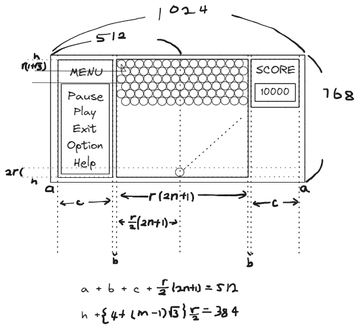

# Digital System Team Project

## Contents

1. Target Board
2. Flow Chart
3. Code

---

## Target Board

ZedBoard Zynq Evaluation and Development Kit
Zynq-7000 SoC

### Board Specification

---

### User IO

---

### Peripheral

---

### ASCII Code

8 : BS : Back Space  
9 : HT : tab  
10 : LF : line feed : 줄바꿈  
13 : CR : Enter  
※ Enter = CR + LF  
32 : SP : Space  

---

## 화면 구상

공의 좌표

삼각함수 계산법

- LUT
- Taylor 시리즈
- CORDIC 알고리즘

- 부동소수점 구현

---

## 이론

1. 1024 x 768, 60Hz

- clk_vga = 65MHz

2. 공 움직임

아래에서 위로 -> y는 감소
$cos(\theta)$는 $\theta$ 가 90º 보다 크면 감소하므로, 항상 $+ cos(\theta)$

x 증가량 : $cos(\theta)$
$\theta$ 는 초기 발사값

---

## Flow Chart

---

### Reference

[Git 사용법](https://github.com/SungChul-CHA/git.git)
